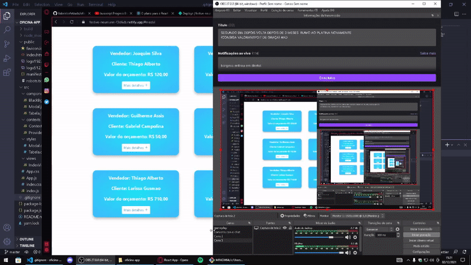

# Oficina App (Codificar)

- https://festive-neumann-f3d6cb.netlify.app/#modal

- A plataforma consume uma api de orçamentos e foi desenvolvida em ReactJS explorando conceitos como o de CONTEXT api, componentização e props.

## Como usar

- Dados de orçamentos aparecerão na tela do usuário e para ver mais detalhes basta clicar no botão do orçamento que deseja-se avaliar.

## Demo

